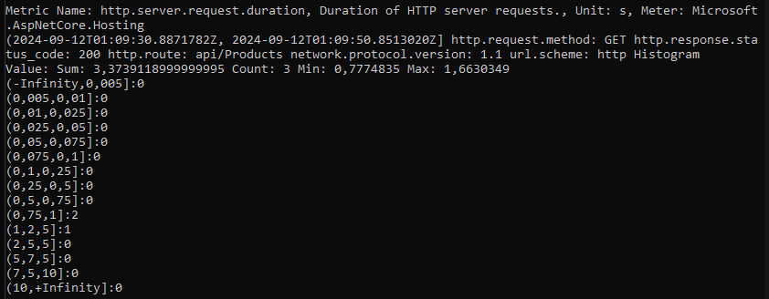
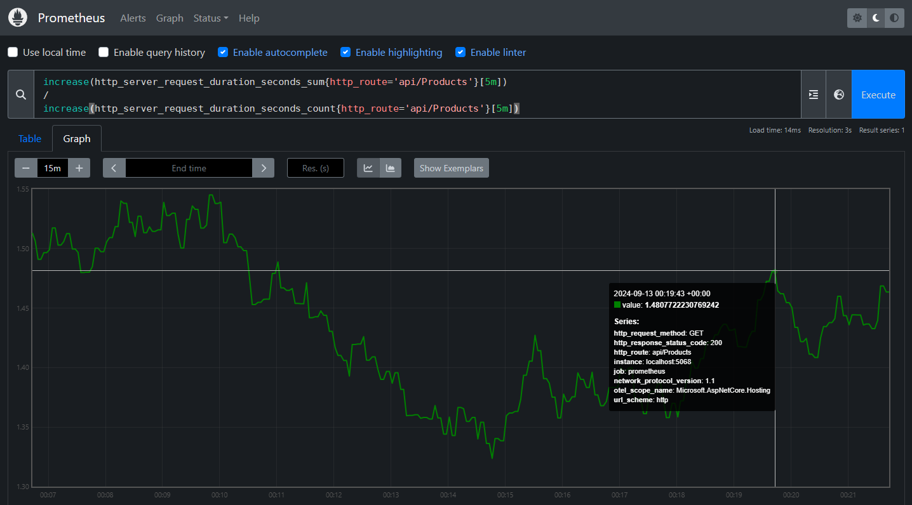
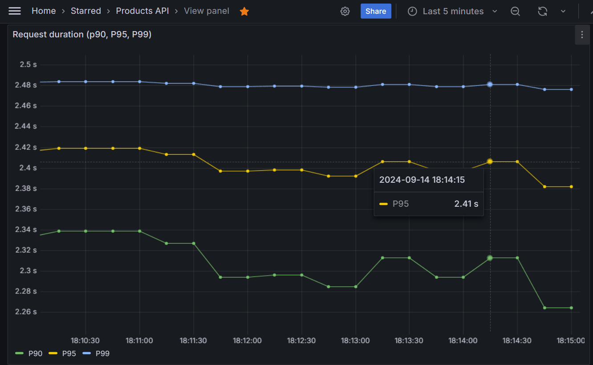

It is crucial to understand an application's behavior, either to analyze specific events to find errors, monitor the application's performance, or track activities in a distributed system. Observability is the capability of an application to do that, through logs, metrics, and tracing.

In this article I’ll be talking about metrics, how to configure an ASP NET Core application to generate metrics, set up Prometheus and Grafana to collect and visualize the metrics.

Metrics are the application's telemetry data over time. For example, the number of requests of an API, the number of errors, and the latency of the request. It is essential to collect that data and monitor it, for example to react to application degradation incidents or understand the application behavior to implement performance improvements.

### Creating an API

The first step here is to create an API using ASP NET Core. I created an API for a fictitious sporting goods store called ShopSports. It has an `/api/Products` endpoint that returns a list of products, containing the name, price and availability. This API needs to communicate with two external services, one for retrieving the products prices, and another to get the procuts availability. In order to simulate a real use scenario, this API generates random delays during the products query to the database, and delays when retrieving data in the other services.

```csharp
public async Task<IActionResult> GetAsync()
{
    var products = await _productRepository.GetAsync();
    var fillPricesTask = _priceService.FillPricesAsync(products);
    var fillAvailabilityTask = _inventoryService.FillAvailabilityAsync(products);
    await Task.WhenAll(fillPricesTask, fillAvailabilityTask);
    return Ok(products);
}
```

### Open Telemetry

The next step is to configure the application to generate metrics. Open Telemetry will be used for that, which is an open source platform of observability, technology agnostic, that supports log, metrics and distributed tracings. ASP NET Core has its Open Telemetry implementation, in the following packages:

```
OpenTelemetry.Instrumentation.AspNetCore
OpenTelemetry.Extensions.Hosting
OpenTelemetry.Exporter.Console
```

After installing these packages, add the following configuration to de dependency injection container configuration:

```cs
var openTelemetryBuilder = builder.Services.AddOpenTelemetry();

openTelemetryBuilder.ConfigureResource(resource => resource
    .AddService(builder.Environment.ApplicationName));

openTelemetryBuilder.WithMetrics(metrics => metrics
    .AddAspNetCoreInstrumentation()
    .AddConsoleExporter());
```

This configuration adds some metrics  by default. We will be looking at the one called `http.server.request.duration`. As the name suggests, this metric measures the request duration which is in seconds.

Since we have added the ```AddConsoleExporter``` to the configuration, a console exporter will be available. An exporter is a way of accessing the snapshot of the metrics at a given period in time. The console exporter will output the metrics from time to time.

This is the console output after doing three request to the ```/api/Producs``` endpoint:



- The type of this metric is Histogram. It registers frequency of values within a range.
- Note that we have defined ranges of values and a number for it. These ranges of values are called buckets. In this example, two of these requests took between 0.75 and 1 second, and the other one took between 1.2 and 5 seconds.
- We have additional information attached to the metrics, for example the `http.response.status_code` and `http.route`. These information are called tags, and can be useful for filtering data.

### Prometheus

Now that the application is instrumenting the metrics, we need a system to collect them, we will be using Prometheus, which uses a pulling system to scrap the metrics of an application. In order for Prometheus to scrap the metrics it is necessary to configure an exporter, that will provide an endpoint for the scrapping. I'll install the package to configure the exporter endpoint:

`OpenTelemetry.Exporter.Prometheus.AspNetCore`

Add the `AddPrometheusExporter` call to the dependency injection container:


```cs
openTelemetryBuilder.WithMetrics(metrics => metrics
    .AddAspNetCoreInstrumentation()
    .AddConsoleExporter()
    .AddPrometheusExporter());
```

And the `MapPrometheusScrapingEndpoint` call somewhere after the `Build` call:

```cs
var app = builder.Build();
...
// Configure the Prometheus scraping endpoint
app.MapPrometheusScrapingEndpoint();
```

Now, the metrics will be available at `/metrics` endpoint.

The next step is to install Prometheus. After the installation it is necessary to specify the target for the scrapping endpoint in the Prometheus YAML file. The target is `localhost:5068`, which is the URL the ShopSports API is running. Besides, for testing purposes I defined the scrape interval of 5s. That means that Prometheus will do the pulling at every 5 seconds:

```yaml
scrape_interval: 5s

scrape_configs:
  - job_name: "prometheus"
    static_configs:
      - targets: ["localhost:5068"]
```

After running Prometheus access its default endpoint at `http://localhost:9090`. On the Prometheus interface it is possible to query metrics using the PromQL language. Also, it is possible to view a graphic for the metric over time.

For exemplification, I'll be sending a request to the `/api/Products` endpoint, every 3 seconds, using Postman. Meanwhile I'll be filtering the request duration average in Prometheus for that endpoint, using the PromQL query:

```yml
increase(http_server_request_duration_seconds_sum{http_route='api/Products'}[5m])
/
increase(http_server_request_duration_seconds_count{http_route='api/Products'}[5m])
```

First, the query calculates the increase of the sum of all request durations in an interval of 5 minutes. Then, it calculates the increase in the last 5 minutes, of count of all requests. Finally, it divides those values to get the average request duration in the informed interval. This is the resultant Prometheus graph:



Note that at `00:19:43` the request duration average was ≈ `1.48` seconds.

### Grafana

Although it is possible to build graphs for our metrics using Prometheus, as seen previously, we also can use Grafana for that, which has a more robust system for creating monitoring dashboards, alerts, and has a richer user interface.

After installing Grafana, we need to configure a datasource in which it will be getting the monitoring data. In the datasource configuration of Grafana choose Prometheus, and specify our Prometheus endpoint which is `http://localhost:9090`.

Now, we'll be creating a dashboard for the request duration metric. One way of viewing samples of request duration over time is using the `histogram_quantile` funcion. The first param for this function is the percentile. For example, when the percentile 90 shows 2 seconds, this indicates that 90% of the request took util 2 seconds, while only 10% took more than that.

These are the queries for percentile 90 (P90):

```
histogram_quantile(0.9, sum by(le) (rate(http_server_request_duration_seconds_bucket{http_route="api/Products", http_response_status_code="200"}[$__rate_interval])))
```

In a single Grafana dashboard is possible to specify multiple queries, this is the dashboard for the P90, P95 and P99:



As we can see at `11:59:30` 90% of the request durations took less than `2.42` seconds. This dashboard is very useful to give an overview of how most of the clients of the API are experience it in terms of request duration.

> MAYBE SHOW THE AVG METRIC

### Custom metrics